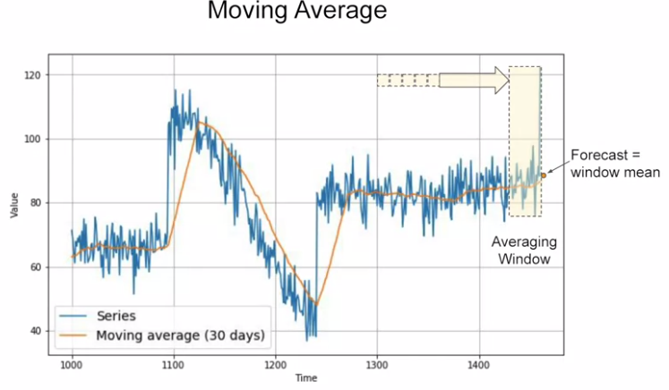
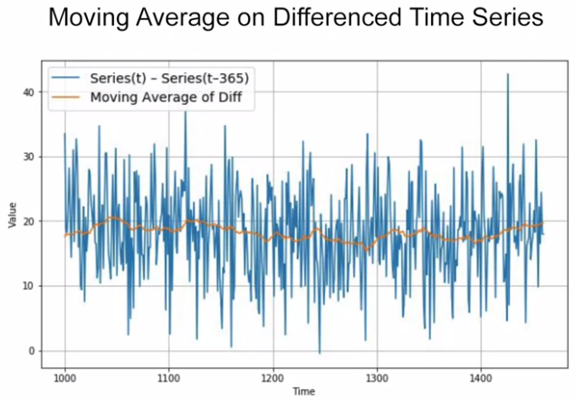
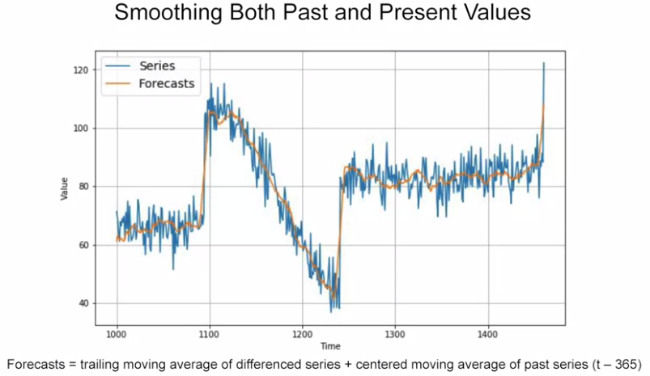

## 1. Moving Average and Differencing

A common and very simple forecasting method is to calculate a moving average. The idea here is that the yellow line is a plot of the average of the blue values over a fixed period called an averaging window, for example, 30 days. 

However, it doesn't anticipate trend or seasonality. To avoid this, we first use a technique called differencing to remove trend and seasonality from this time series, by studying the difference between the value at time T and the value at an earlier period, e.g. 365 days ago.

Next, we also apply moving average on the past series from the earlier period, and we add the differenced series to it.

## 2. Trailing VS Centered Windows

In this example:

Centered Window: (T - 1 year - 5 days) : (T - 1 year + 5 days)

Trailing Window: (T - 32 days) : (T - 1 day)

Thus, centered window seems more accurate than trailing window. But we can't use centered windows to smooth present values since we don't know future values. However, to smooth past values we can afford to use centered windows.

